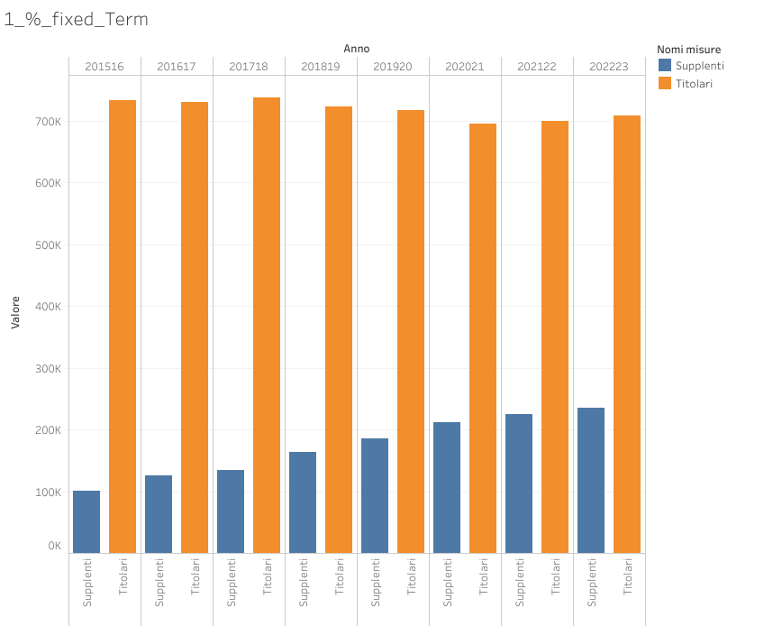

# Introduction
The goal of this project is to analyze the Italian education system, focusing on regional disparities across administrative areas and identifying the key factors contributing the improvement or the decline of educational standards.

# Data and Tools
The data used for the analysis come from the [ministry of educucation website](https://dati.istruzione.it/opendata/opendata/catalogo/), in the open data section. Among the different topics present in portal, we focues mainly on the folowing themes:
- School (SCUOLE): anagraphic information.
- Students (STUDENTI): age, genre, nationality.
- School employees (PERSONALE SCUOLA): fixed term and permanent.
- School Budget (BILANCIO INTEGRATO DELLE SCUOLE): balance sheet.

The portal covers a lot of topics, so I don't exclude that I may cover further topics in the future for the analysis.

The tools used for my data analysis are:
- Python: since the portal contains one dataset for each school year, I used Pandas to append all the dataset with the same format and made some data cleaning.
- PostgreSQL: I created the database, loaded the csv modified by Pandas and made different queries to investigate the data.
- Tableau Public: I loaded the results from the SQL queries and created some visualizations in order to show the insights.

# Few words about the database
I will not go in the details, even because I am not expert and this is not the scope of the discussion.
I created the database with PostgreSQl and I imported the csv files generated with Pandas in each table of the database. You can check the SQL files in the github folder.

# 1 - Fixed Term vs Permanent Contract Teachers
The picture below shows how the fixed term teachers have increased year by year (last year available is 202223) compared to the permanent teachers.

You can also see the same in terms of percentage.

# 2 - WIP
# 3 - WIP

# 4 - School Budget - WIP

