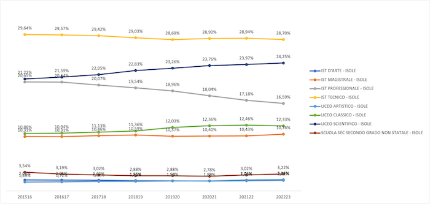

# Introduction
This project aims to analyze the Italian education system, focusing on regional disparities across administrative areas and identifying key factors contributing to the improvement or decline of educational standards.

# Data and Tools
The data used for the analysis come from the [Ministry of Education website](https://dati.istruzione.it/opendata/opendata/catalogo/), specifically from the Open Data section. Among the various topics available on the portal, the focus is primarily on the following themes:
- ***School (SCUOLE)***: Anagraphic information.
- ***Students (STUDENTI)***: Age, gender, nationality.
- ***School employees (PERSONALE SCUOLA)***: Fixed-term and permanent staff.
- ***School Budget (BILANCIO INTEGRATO DELLE SCUOLE)***: Balance sheet data.

The information are available up to the 2022-2023 academic year.

The portal covers many topics, and I may explore additional themes in future analyses.

***Tools Used:***
- ***Python***: Given the portal’s structure (one dataset per school year), I used Pandas to append datasets with the same format and perform data cleaning.
- ***PostgreSQL***: I created a database, loaded the cleaned CSV files, and executed queries to explore the data.
- ***Tableau Public***: SQL query results were visualized using Tableau to present insights effectively.

# Database Overview
This section provides an overview of the database used in the project.

I created the database using PostgreSQL and imported the CSV files processed with Pandas into separate tables.

The resulting ER diagram is shown below. ***Note:*** I am fully aware that the database design, including the management of primary keys, foreign keys, and relationships between tables, could be optimized. However, this is beyond the scope of this publication.


Here below I report the SQL code used but you can also check it the "SQL Load" folder. You can skip this part and go to the [analysis](#1---fixed-term-vs-permanent-contract-teachers) if you are not interested.

Creation of the postgreSQL database after connecting VS Code with Postgres:
```sql
CREATE DATABASE scuola;
```

Creation of the tables:
```sql
CREATE TABLE public.anno_scolastico
(
    ANNOSCOLASTICO INT PRIMARY KEY
);

CREATE TABLE public.location
(
    PROVINCIA TEXT PRIMARY KEY,
    REGIONE TEXT,
    AREAGEOGRAFICA TEXT
);

CREATE TABLE public.tipoistituto
(
    DESCRIZIONETIPOLOGIAGRADOISTRUZIONESCUOLA TEXT PRIMARY KEY,
    TIPO_SCUOLA TEXT
);

CREATE TABLE public.anagrafe
(
    AREAGEOGRAFICA TEXT,	
    REGIONE TEXT,
    PROVINCIA TEXT,
    CODICESCUOLA TEXT PRIMARY KEY,
    DENOMINAZIONESCUOLA TEXT,
    INDIRIZZOSCUOLA	TEXT,
    CAPSCUOLA INT,
    CODICECOMUNESCUOLA TEXT,
    DESCRIZIONECOMUNE TEXT,
    DESCRIZIONETIPOLOGIAGRADOISTRUZIONESCUOLA TEXT,	
    INDIRIZZOEMAILSCUOLA TEXT,	
    INDIRIZZOPECSCUOLA	TEXT, 
    SITOWEBSCUOLA TEXT, 
    CODICEISTITUTORIFERIMENTO TEXT,
    DENOMINAZIONEISTITUTORIFERIMENTO TEXT,
    DESCRIZIONECARATTERISTICASCUOLA	TEXT,
    INDICAZIONESEDEDIRETTIVO TEXT,
    INDICAZIONESEDEOMNICOMPRENSIVO TEXT,
    SEDESCOLASTICA TEXT,
    FOREIGN KEY (DESCRIZIONETIPOLOGIAGRADOISTRUZIONESCUOLA) REFERENCES public.tipoistituto (DESCRIZIONETIPOLOGIAGRADOISTRUZIONESCUOLA)
);


CREATE TABLE public.distrib_cittadinanza
(
    ANNOSCOLASTICO INT,
    CODICESCUOLA TEXT,
    ORDINESCUOLA TEXT,
    ANNOCORSO INT,
    ALUNNI INT,
    ALUNNICITTADINANZAITALIANA	INT,
    ALUNNICITTADINANZANONITALIANA INT,
    ALUNNICITTADINANZANONITALIANAPAESIUE INT,
    ALUNNICITTADINANZANONITALIANAPAESINONUE INT,
    FOREIGN KEY (CODICESCUOLA) REFERENCES public.anagrafe (CODICESCUOLA),
    FOREIGN KEY (ANNOSCOLASTICO) REFERENCES public.anno_scolastico (ANNOSCOLASTICO)
);


CREATE TABLE public.distrib_eta
(
    ANNOSCOLASTICO INT,
    CODICESCUOLA TEXT,
    ORDINESCUOLA TEXT,
    ANNOCORSO INT,
    FASCIAETA TEXT,
    ALUNNI INT,
    FOREIGN KEY (CODICESCUOLA) REFERENCES public.anagrafe (CODICESCUOLA),
    FOREIGN KEY (ANNOSCOLASTICO) REFERENCES public.anno_scolastico (ANNOSCOLASTICO)
);

CREATE TABLE public.distrib_genere
(
    ANNOSCOLASTICO INT,
    CODICESCUOLA TEXT,
    ORDINESCUOLA TEXT,
    ANNOCORSO INT,
    CLASSI INT,
    ALUNNIMASCHI INT,
    ALUNNIFEMMINE INT,
    FOREIGN KEY (CODICESCUOLA) REFERENCES public.anagrafe (CODICESCUOLA),
    FOREIGN KEY (ANNOSCOLASTICO) REFERENCES public.anno_scolastico (ANNOSCOLASTICO)
);

CREATE TABLE public.distrib_ind_secondaria
(
    ANNOSCOLASTICO INT,
    CODICESCUOLA TEXT,
    ORDINESCUOLA TEXT,
    ANNOCORSO INT,
    TIPOPERCORSO TEXT,
    PERCORSO TEXT,
    INDIRIZZO TEXT,
    ALUNNIMASCHI INT,
    ALUNNIFEMMINE INT,
    FOREIGN KEY (CODICESCUOLA) REFERENCES public.anagrafe (CODICESCUOLA),
    FOREIGN KEY (ANNOSCOLASTICO) REFERENCES public.anno_scolastico (ANNOSCOLASTICO)
);

CREATE TABLE public.num_bambini_cittadinanza
(
    ANNOSCOLASTICO INT,
    CODICESCUOLA TEXT,
    BAMBINICITTADINANZAITALIANA INT,
    BAMBINICITTADINANZANONITALIANA INT,
    FOREIGN KEY (CODICESCUOLA) REFERENCES public.anagrafe (CODICESCUOLA),
    FOREIGN KEY (ANNOSCOLASTICO) REFERENCES public.anno_scolastico (ANNOSCOLASTICO)
);

CREATE TABLE public.num_bambini
(
    ANNOSCOLASTICO INT,
    CODICESCUOLA TEXT,
    CLASSI INT,
    BAMBINIMASCHI INT,
    BAMBINIFEMMINE INT,
    FOREIGN KEY (CODICESCUOLA) REFERENCES public.anagrafe (CODICESCUOLA),
    FOREIGN KEY (ANNOSCOLASTICO) REFERENCES public.anno_scolastico (ANNOSCOLASTICO),
    FOREIGN KEY (PROVINCIA) REFERENCES public.location (PROVINCIA)
);

CREATE TABLE public.num_docenti_indet
(
    ANNOSCOLASTICO INT,
    PROVINCIA TEXT,
    ORDINESCUOLA TEXT,
    TIPOPOSTO TEXT,
    FASCIAETA TEXT,
    DOCENTITITOLARIMASCHI INT,
    DOCENTITITOLARIFEMMINE INT,
    FOREIGN KEY (ANNOSCOLASTICO) REFERENCES public.anno_scolastico (ANNOSCOLASTICO),
    FOREIGN KEY (PROVINCIA) REFERENCES public.location (PROVINCIA)
);

CREATE TABLE public.num_docenti_suppl
(
    ANNOSCOLASTICO INT,
    PROVINCIA TEXT,
    ORDINESCUOLA TEXT,
    TIPOPOSTO TEXT,
    TIPOSUPPLENZA TEXT,
    FASCIAETA TEXT,
    DOCENTISUPPLENTIMASCHI INT,
    DOCENTISUPPLENTIFEMMINE INT,
    FOREIGN KEY (ANNOSCOLASTICO) REFERENCES public.anno_scolastico (ANNOSCOLASTICO)
    FOREIGN KEY (PROVINCIA) REFERENCES public.location (PROVINCIA)
);


CREATE TABLE public.codice_livello (
    TIPOLOGIAVOCE TEXT,
    CODICELIVELLO1 TEXT,
    DESCRIZIONELIVELLO1 TEXT,
    CODICELIVELLO2 TEXT,
    DESCRIZIONELIVELLO2 TEXT
);

CREATE TABLE public.bilancio_consuntivo
(
    ANNOSCOLASTICO INT,
    ANNOFINANZIARIO INT,
    REGIONE TEXT,
    CODICESCUOLA TEXT,
    DATAAPPROVAZIONEDS TEXT,
    DATAAPPROVAZIONEGIUNTA TEXT,
    DATAAPPROVAZIONECONSIGLIO TEXT,
    TIPOLOGIAVOCE TEXT,
    CODICELIVELLO1 TEXT,
    CODICELIVELLO2 TEXT,
    IMPORTO NUMERIC,
    IMPORTOACCERTATOIMPEGNATO NUMERIC,
    IMPORTORISCOSSOPAGATO NUMERIC,
    IMPORTODARISCUOTEREDAPAGARE NUMERIC,
    FOREIGN KEY (ANNOSCOLASTICO) REFERENCES public.anno_scolastico (ANNOSCOLASTICO),
    FOREIGN KEY (CODICESCUOLA) REFERENCES public.anagrafe (CODICESCUOLA)
);
```
Some string manipulations that will be helpful later.
```sql
UPDATE anagrafe
SET regione = 'FRIULI-VENEZIA GIULIA' 
WHERE regione = 'FRIULI-VENEZIA G.';

UPDATE location
SET regione = 'FRIULI-VENEZIA GIULIA' 
WHERE regione = 'FRIULI-VENEZIA G.';

UPDATE bilancio_consuntivo
SET regione = 'FRIULI-VENEZIA GIULIA' 
WHERE regione = 'FRIULI-VENEZIA G.';

UPDATE public.tipoistituto
SET tipo_scuola = 'SCUOLA SEC SECONDO GRADO NON STATALE'
WHERE tipo_scuola = 'SCUOLA SEC SECONDO GRADO';
```
I created some columns that will be used in the queries.
```sql
ALTER TABLE public.codice_livello 
ADD COLUMN CODICELIVELLOKEY TEXT,
ADD COLUMN DESCRIZIONE TEXT;

UPDATE public.codice_livello
SET
    CODICELIVELLOKEY = CODICELIVELLO1 || CODICELIVELLO2,
    DESCRIZIONE = CONCAT(DESCRIZIONELIVELLO1,' ',DESCRIZIONELIVELLO2);

ALTER TABLE public.codice_livello
ADD CONSTRAINT codice_livello_pkey PRIMARY KEY (CODICELIVELLOKEY);

ALTER TABLE public.bilancio_consuntivo
ADD COLUMN CODICELIVELLOKEY TEXT;

UPDATE public.bilancio_consuntivo
SET CODICELIVELLOKEY = CODICELIVELLO1 || CODICELIVELLO2;

ALTER TABLE num_docenti_indet ADD COLUMN docenti INTEGER;

UPDATE num_docenti_indet
SET docenti = docentititolarimaschi + docentititolarifemmine;

ALTER TABLE num_docenti_suppl ADD COLUMN docenti INTEGER;

UPDATE num_docenti_suppl
SET docenti = docentisupplentimaschi + docentisupplentifemmine;

ALTER TABLE distrib_ind_secondaria ADD COLUMN alunni INTEGER;

UPDATE distrib_ind_secondaria
SET alunni = alunnimaschi + alunnifemmine;
```
Set ownership of the tables to the postgres user

```sql
ALTER TABLE public.anagrafe OWNER to postgres;
ALTER TABLE public.distrib_cittadinanza OWNER to postgres;
ALTER TABLE public.distrib_eta OWNER to postgres;
ALTER TABLE public.distrib_genere OWNER to postgres;
ALTER TABLE public.distrib_ind_secondaria OWNER to postgres;
ALTER TABLE public.num_bambini OWNER to postgres;
ALTER TABLE public.num_bambini_cittadinanza OWNER to postgres;
ALTER TABLE public.num_docenti_indet OWNER to postgres;
ALTER TABLE public.num_docenti_suppl OWNER to postgres;
ALTER TABLE public.anno_scolastico OWNER to postgres;
ALTER TABLE public.location OWNER to postgres;
ALTER TABLE public.tipoistituto OWNER to postgres;
ALTER TABLE public.codice_livello OWNER to postgres;
ALTER TABLE public.bilancio_consuntivo OWNER to postgres;
```
Create indexes on foreign key columns for better performance

```sql
CREATE INDEX idx_distrib_cittadinanza_codicescuola ON public.distrib_cittadinanza(codicescuola);
CREATE INDEX idx_distrib_eta_codicescuola ON public.distrib_eta(codicescuola);
CREATE INDEX idx_distrib_genere_codicescuola ON public.distrib_genere(codicescuola);
CREATE INDEX idx_distrib_ind_secondaria_codicescuola ON public.distrib_ind_secondaria(codicescuola);
CREATE INDEX idx_num_bambini_codicescuola ON public.num_bambini(codicescuola);
CREATE INDEX idx_num_bambini_cittadinanza_codicescuola ON public.num_bambini_cittadinanza(codicescuola);
CREATE INDEX idx_bilancio_consuntivo_codicescuola ON public.bilancio_consuntivo(codicescuola);
CREATE INDEX idx_codice_livello_clkey ON public.codice_livello(codicelivellokey);
CREATE INDEX idx_bilancio_consuntivo_clkey ON public.bilancio_consuntivo(codicelivellokey);
```

# 1 - Fixed Term vs Permanent Contract Teachers
The initial analysis aims to illustrate the trend in fixed-term and permanent teaching contracts over time. The data is represented by the SQL query below:

```sql
WITH titolari AS (
SELECT 
    a.annoscolastico anno_scolastico,
    sum(i.docenti) docenti_titolari
FROM
    anno_scolastico a
INNER JOIN num_docenti_indet i ON a.annoscolastico = i.annoscolastico
GROUP BY a.annoscolastico
)
SELECT 
    s.annoscolastico anno,
    sum(s.docenti) supplenti,
    titolari.docenti_titolari titolari,
    ROUND(sum(s.docenti)::NUMERIC / (sum(s.docenti) + titolari.docenti_titolari)*100, 2) perc_supplenti
    FROM num_docenti_suppl s
INNER JOIN titolari ON s.annoscolastico = titolari.anno_scolastico
GROUP BY s.annoscolastico,titolari.docenti_titolari;
```

### Key Findings

The results of the query are visualized in the following charts:

***1.	Trend of Fixed-Term vs. Permanent Teachers***

This chart illustrates the year-over-year growth in fixed-term teachers relative to permanent teachers.


***2.	Percentage of Fixed-Term Teachers***

This chart shows the percentage breakdown of fixed-term teachers over time.


### Observations

These visualizations reveal a concerning trend: over the past seven years, the percentage of fixed-term teaching staff has doubled.

A high proportion of fixed-term contracts often results in increased staff turnover, disrupting the continuity of teaching and potentially compromising the quality of education. To address these issues, it is crucial to implement measures aimed at increasing the number of permanent teaching positions, thereby ensuring stability and maintaining high standards in education delivery.

# 2 - Choice of the secondary school
This section analyzes the relationship between school type selection, students’ nationalities and country area, with a focus on secondary schools.

## Analysis 1: Nationality and School Type
For the 2022-2023 academic year, the SQL query below calculates the following metrics for each type of secondary school:
- The number of Italian students
- The number of non-Italian students
- The percentage of non-Italian students

```sql
SELECT 
    t.tipo_scuola tipo,
    sum(d.alunnicittadinanzanonitalianapaesinonue) stranieri,
    sum(d.alunnicittadinanzaitaliana) italiani,
    ROUND(sum(d.alunnicittadinanzanonitalianapaesinonue)::NUMERIC / (sum(d.alunnicittadinanzanonitalianapaesinonue) + sum(d.alunnicittadinanzaitaliana))*100, 2) perc_stranieri
FROM distrib_cittadinanza d
INNER JOIN anagrafe a ON d.codicescuola = a.codicescuola
INNER JOIN tipoistituto t ON a.descrizionetipologiagradoistruzionescuola = t.descrizionetipologiagradoistruzionescuola
WHERE annoscolastico = 202223 AND
    ordinescuola = 'SCUOLA SECONDARIA II GRADO' AND
    t.tipo_scuola <> 'SCUOLA SEC SECONDO GRADO NON STATALE'
GROUP BY t.tipo_scuola
ORDER BY perc_stranieri DESC;
```

The table below summarizes the query results:


### Observations

The data indicates that professional institutes are the most preferred school type among non-Italian students, having the highest percentage of non-Italian enrollment compared to other secondary school types.

## Analysis 2: Regional Trends in School Selection
This analysis examines the trends in school selection across five geographical areas of Italy (North-West, North-East, Center, South, and Islands). The SQL query below retrieves the total number of students by school type for each area and academic year.

```sql
SELECT
    d.annoscolastico anno,
    a.areageografica area,
    t.tipo_scuola tipo,
    sum(d.alunni) alunni
FROM distrib_ind_secondaria d
INNER JOIN anagrafe a ON a.codicescuola = d.codicescuola
INNER JOIN tipoistituto t ON a.descrizionetipologiagradoistruzionescuola = t.descrizionetipologiagradoistruzionescuola
GROUP BY d.annoscolastico, a.areageografica, t.tipo_scuola
ORDER BY 1,2;
```

I visualized the query results using Excel charts instead of Tableau because the trend line chart requires a date format, while the school year data is stored as text in this case.


*School choice trend in north-west area.*


*School choice trend in north-east area.*


*School choice trend in the center area.*


*School choice trend in south area.*


*School choice trend in the main islands.*

### Key Findings
1.	School Popularity (Descending Order):
	1.	Technical Institutes
	2.	Scientific High Schools
	3.	Professional Institutes
	4.	Classical High Schools
	5.	Teacher Training Institutes

2.	Trends by School Type:
	- Scientific High Schools show a consistent increase across all regions.
	- Professional Institutes exhibit a decreasing trend nationwide.
	- Technical Institutes display mixed results:
	- Slight decreases in the Center, Islands, and South.
	- Stability or slight increases in the North-West and North-East.
	- Classical High Schools remain stable across all areas.

# 3 - Age distribution
This analysis examines the distribution of students’ ages and highlights trends that may inform projections for the future.

## Analysis 1: Trend in Student Numbers by School Grade
This analysis explores the trend in student numbers across different school grades. The SQL query used is as follows:

```sql
SELECT 
    annoscolastico,
    ordinescuola,
    sum(alunni) alunni 
FROM distrib_eta
GROUP BY annoscolastico, ordinescuola
ORDER BY ordinescuola, annoscolastico;
```

The results are visualized in the Excel chart below:


### Observations

- The number of students in primary schools is declining. A likely contributing factor is the significant decrease in birth rates over the past decade, leading to fewer young children.
- Conversely, the number of students in high schools is increasing.
- Despite this, the overall number of students continues to decline year after year, reflecting broader demographic shifts.

## Analysis 2: Number of Children in Primary School
This analysis builds on the observations from the first analysis, focusing specifically on the number of children enrolled in nursery schools. The SQL query used is as follows:

```sql
SELECT
     annoscolastico school_year,
     sum(bambinimaschi + bambinifemmine) children,
     ROUND(
        (SUM(bambinimaschi + bambinifemmine) - LAG(SUM(bambinimaschi + bambinifemmine)) OVER (ORDER BY annoscolastico)) 
        * 100.0 
        / NULLIF(LAG(SUM(bambinimaschi + bambinifemmine)) OVER (ORDER BY annoscolastico), 0),
        2
    ) AS perc_YOY_variation ,
    ROUND(
        (SUM(bambinimaschi + bambinifemmine) - FIRST_VALUE(SUM(bambinimaschi + bambinifemmine)) OVER (ORDER BY annoscolastico))
        * 100.0
        / NULLIF(FIRST_VALUE(SUM(bambinimaschi + bambinifemmine)) OVER (ORDER BY annoscolastico), 0),
        2
    ) AS perc_YTD_variation
FROM num_bambini
GROUP BY annoscolastico
ORDER BY annoscolastico;
```

The table below summarizes the query results:

| year           | children | %_YOY_variation  | %_YTD_variation |
|----------------|----------|------------------|-----------------|
| 201718         | 1420396  | NULL             | 0.00            |
| 201819         | 1367752  | -3.71            | -3.71           |
| 201920         | 1323274  | -3.25            | -6.84           |
| 202021         | 1258651  | -4.88            | -11.39          |
| 202122         | 1274410  | 1.25             | -10.28          |
| 202223         | 1252632  | -1.71            | -11.81          |


### Observations

The data clearly illustrates that the decline in birth rates is having a substantial impact on the number of children enrolled in nursery schools.
- From the 2017-18 to 2022-23 academic years, the total number of children in nursery schools decreased by 11.81%.
- The year-over-year (YoY) variation shows consistent decreases, with a brief positive spike in 2021-22 (+1.25%), likely reflecting temporary factors.
- This downward trend underscores broader demographic challenges, such as declining birth rates and their impact on early education systems.

# 4 - School Budget
We have reached the most critical part of the analysis: the school budget. By examining the various types of income and expenses, the goal is to uncover insights and identify potential challenges in financial management.

Unfortunately, due to the unavailability of data from the Ministry of Education, the regions of Valle D’Aosta, Trento, and Bolzano are excluded from this analysis.

You can explore the dashboard I created for the budget analysis at the following [link](https://public.tableau.com/app/profile/leonardo.castiglione1355/viz/4_budget/4_Budget?publish=yes). The dashboard allows you to select specific regions or provinces and view detailed information on the right side for each selected area. 

The data displayed in the dashboard is derived from the following SQL query:

```sql
SELECT 
    b.annoscolastico,
    a.regione regione,
    a.provincia provincia,
    c.descrizionelivello1 descrizione1,
    c.descrizionelivello2 descrizione2,
    c.tipologiavoce tipo,
    sum(b.importo) importo  
FROM bilancio_consuntivo b
INNER JOIN codice_livello c ON c.codicelivellokey = b.codicelivellokey
INNER JOIN anagrafe a ON a.codicescuola = b.codicescuola
GROUP BY b.annoscolastico, a.regione, a.provincia, c.tipologiavoce, c.descrizionelivello1, c.descrizionelivello2
ORDER BY importo DESC;
```

## Observation #1: Administrative Surplus
One of the first observations is that a significant portion of income (above 38% at the national level for all analyzed academic years) comes from the presumed administrative surplus, most of which is restricted.


*Surplus vs incomes year by year.*

When the presumed administrative surplus (both restricted and unrestricted) constitutes a significant portion of a school’s revenues, it reveals both operational dependencies and financial vulnerabilities.

### Implications of a High Presumed Administrative Surplus in School Budgets

In the context of Italian school budgets, the presumed administrative surplus is the leftover amount from the previous year’s budget, calculated as:

***Cash balance + Active residuals - Passive residuals***

While this surplus can serve as a temporary financial buffer, its large proportion within total revenues indicates potential challenges:
1.	***Dependency on Past Resources***: A substantial reliance on the administrative surplus suggests that current operations depend heavily on leftover funds, rather than fresh revenues. This can hinder long-term planning and financial sustainability.
2.	***Indication of Delayed Funding***: A high surplus often reflects delays in the transfer of funds, especially from government entities. Schools may accumulate active residuals (uncollected promised revenues), leading to operational uncertainties.
3.	***Restricted Funds Usage***: A portion of the surplus is typically restricted (vincolato), meaning it can only be used for specific purposes, such as designated projects or infrastructure. This limits the school’s flexibility in addressing unforeseen needs.
4.	***Potential Underutilization of Resources***: If a surplus grows consistently, it could indicate inefficiencies in resource allocation or difficulties in executing planned projects, often due to a lack of timely funding or administrative constraints.
5.	***Misleading Financial Health Indicators***: A large surplus may create the illusion of financial stability, but in reality, it often highlights structural issues like insufficient funding or reliance on residuals that are not guaranteed to materialize.

## Observation #2: EU Funds

The second observation from the dashboard is that a significant portion of the income comes from EU funds. You can explore how these funds are distributed across regions at this [link](https://public.tableau.com/app/profile/leonardo.castiglione1355/viz/4_budget/4_Budget_EU_funds?publish=yes).


In recent years, European funds have become a growing and significant portion of school revenues, especially in regions with limited local or state funding. These funds are primarily allocated through programs like the European Structural Funds (ESF and ERDF) and specific initiatives such as PON (National Operational Programs), targeting areas with economic and social challenges.

### Implications of Increasing European Funding
***1.	Enhanced Financial Resources***: The growth of European funds provides schools with additional resources to support projects related to:
	•	Digital transformation.
	•	Teacher and student training programs.
	•	Infrastructure improvements.
	•	Reducing social and educational inequalities.

***2.	Regional Balancing***: Regions in the South of Italy, such as Campania, Puglia, Calabria, and Sicily, benefit significantly from these funds, helping bridge the financial gap between them and wealthier regions in the North.

***3.	Dependency on External Funding***: While European funds offer opportunities, they also create a dependency on external resources, which are often project-specific and not guaranteed for general operational needs. Schools may face difficulties in sustaining initiatives once the funding cycle ends.

***4.	Administrative Complexity***: Accessing and managing European funds requires schools to navigate complex bureaucratic processes, including detailed project proposals, reporting, and compliance with EU regulations. This can strain administrative resources, especially in smaller schools.

***5.	Focus on Targeted Projects***: European funds are typically tied to specific objectives, limiting their flexibility. Schools must align their activities with EU priorities, which may not always match their immediate or local needs.

# Conclusions
The Italian school system demonstrates both strengths and areas needing improvement. The insights provided by this project underscore the need for targeted interventions to reduce regional disparities, enhance resource allocation, and support student success across the country.


